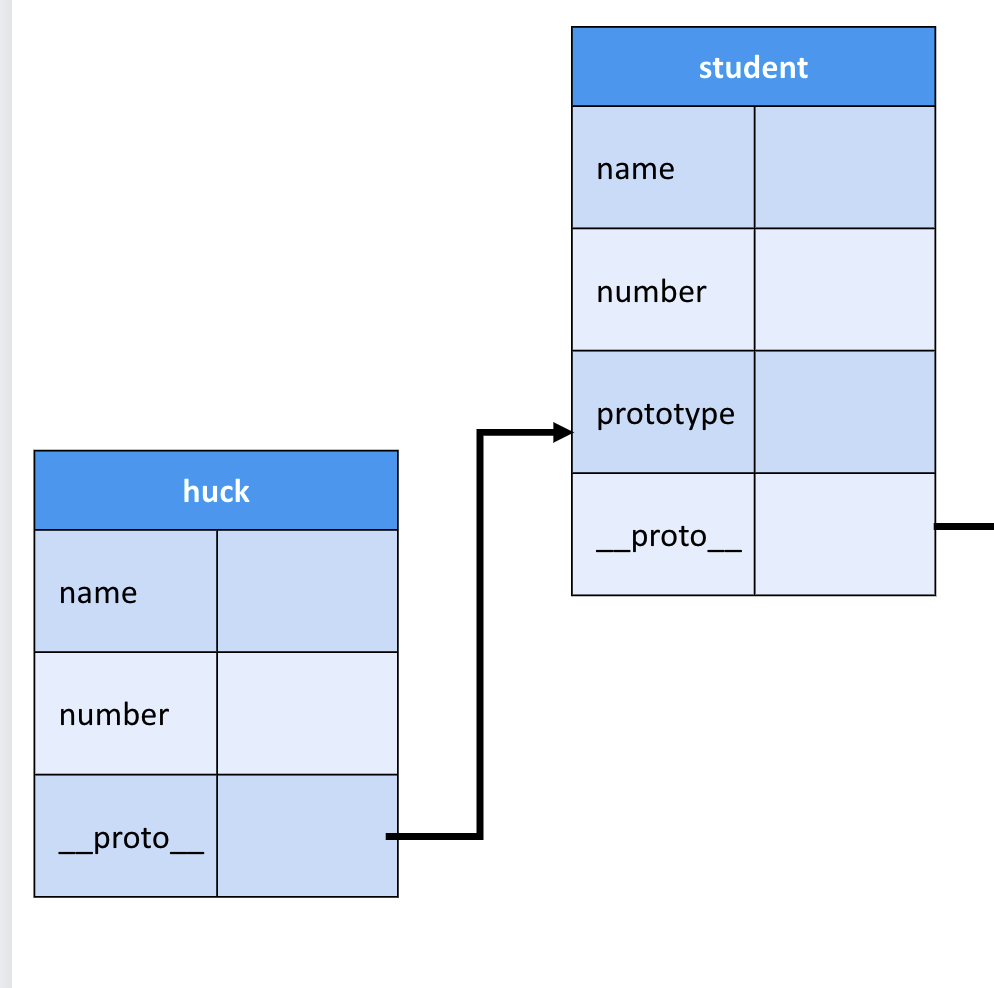
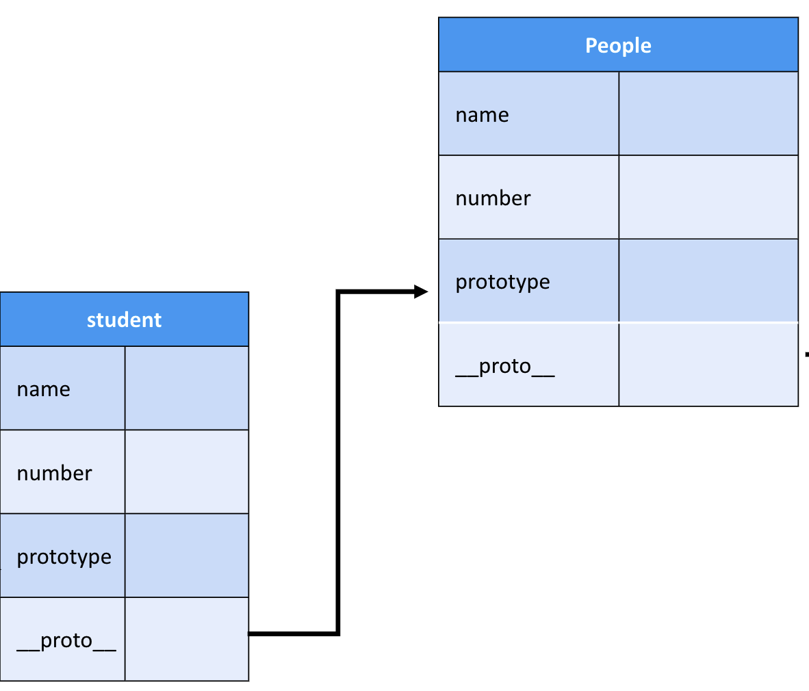
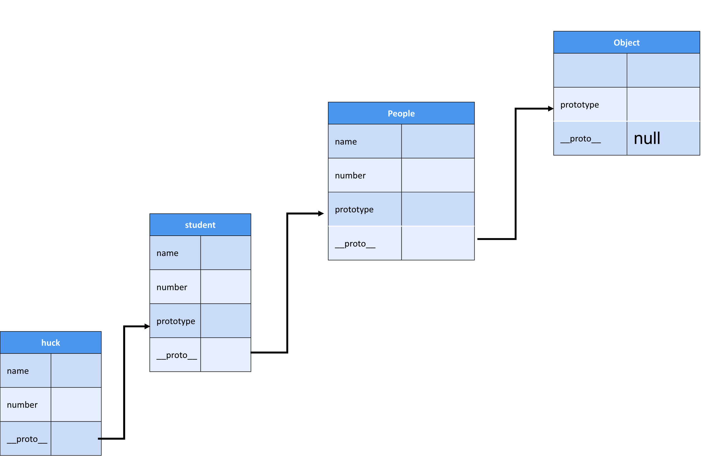

there is simple question how can you check if a variable is an Array。
the answer is easy 
```
arr instanceof Array
```
if result is true  ,arr is Array .otherwise  arr isn't;

so there is another question：  what's  principle behind instanceof in Javascript

let me explain

there're two classes. People and Student . Student implements People
```
class People{
    constructor(name){
        this.name = name
    }
    eat(){
        console.log(`${this.name} eat something`)
    }
}

class Student extends People{
    constructor(name,number){
        super(name); // the parent class handles this property
        this.number =number;
    }
    sayHi(){
        console.log(`name ${this.name}, no ${this.number}`)
    }
}
```

```
const huck = new Student('huck',100);
console.log(huck.name)
console.log(huck.number)
huck.sayHi();
```

"huck" is an instance of Student;

Here are the 3 basic rules in Prototype
"Every class in Javascript has a explicit prototype property"
"Every instance in Javascript has implicit prototype, __proto__"
"An instance's __proto__ prototype points to corresponding class"

take the value "huck" for example 

huck has a `__proto__`  points to Student's prototype.



and Student‘s  `__proto__`  points to People's prototype.



and People‘s  `__proto__`  points to Object's prototype.


Object‘s  `__proto__`  points to null


